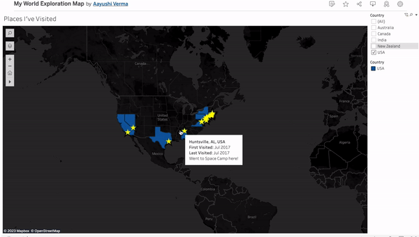
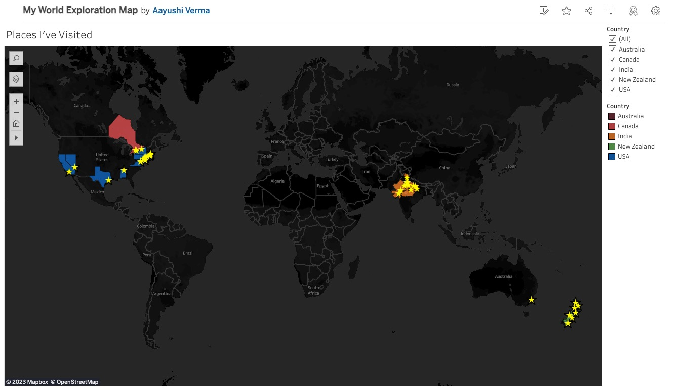

# My World Exploration Map
This is a very simple Tableau map, showing all the places I've ever visited! You can interact with the map [here on Tableau Public](https://public.tableau.com/app/profile/aayushi.verma/viz/my_world_exploration_map/PlacesIveBeen).

## Authors

- [@awesomecosmos](https://www.github.com/awesomecosmos) (me!)

## Table of Contents

  - [Motivation](#motivation)
  - [How It Works](#how-it-works)
  - [How To Use](#how-to-use)
  
## Motivation
I recently attended the Tableau Conference in Las Vegas in May 2023, and learned a lot about creative uses of Tableau. One of the features of Tableau that struck out to me the most was its easy handling of geospatial data in an interactive manner. For a long time, I'd been meaning to create an interactive "scratch-off" map of the world, where I could highlight places I've visited, along with some metadata about my visit(s). So during the conference, it occurred to me that I could just make a custom dataset populated with my own travel metadata, and feed it to Tableau to get the interactive map visualization I've always wanted! [Here's the result](https://public.tableau.com/app/profile/aayushi.verma/viz/my_world_exploration_map/PlacesIveBeen)!

## How It Works
In this repository, there is a folder `data` which contains an Excel file. This is my custom data file where I can input data to my liking. This data has the following fields:
- Country - to indicate which countries I've visited
- State/Province/Region - to indicate the states, provinces, and/or regions within countries I've visited
- City - to indicate (at the most granular level) the cities I've visited
- First Visited - to indicate the first time I visited that place (if I remember, otherwise blank)
- Last Visited - to indicate the last time I visited that place (if I remember, otherwise blank)
- Visit Status - to indicate my familiarity with the location.
  - 'Lived' means I stayed in that location for at least 1 month.
  - 'Regularly visited' means I visit/visited that location occasionally or frequently.
  - 'Visited' means I visited that place very infrequently, maybe only once.
- Comments - my comments about that place

This Excel file is the input to the Tableau dashboard, and simply visualizes that data for me! I also added filters for the countries, and color-coded by country.

## How To Use
Leave a star if you liked this work! :)
If you want to make an interactive Tableau map to record your own adventures, feel free to fork this repository and change the data in the data file! Please cite my original work if you do so! 
